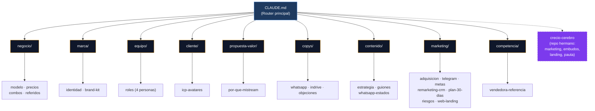

# MiStream · Cerebro del Proyecto

### _Todas tus pantallas en un solo lugar — privadas, baratas y con soporte real_

**El segundo cerebro de MiStream** — negocio, precios, marca, equipo, contenido y estrategia, todo en un solo lugar y como única fuente de verdad.

---

## Mapa del Cerebro

> `CLAUDE.md` es el **router**: léelo primero y te dirige a dónde está cada cosa.

---

## Navegación rápida

| Carpeta | Qué encuentras | Empieza por |
|:---|:---|:---|
| **raíz** | El router del proyecto | [`CLAUDE.md`](CLAUDE.md) |
| **negocio/** | Cómo se gana la plata | [`modelo`](negocio/modelo.md) · [`precios`](negocio/precios.md) · [`combos`](negocio/combos.md) · [`referidos`](negocio/referidos.md) |
| **marca/** | Identidad visual y tono | [`identidad`](marca/identidad.md) · [`brand-kit`](marca/brand-kit.md) |
| **equipo/** | Quién hace qué (4 personas) | [`roles`](equipo/roles.md) |
| **cliente/** | A quién le vendemos | [`icp-avatares`](cliente/icp-avatares.md) |
| **propuesta-valor/** | Por qué comprarnos | [`por-que-mistream`](propuesta-valor/por-que-mistream.md) |
| **copys/** | Qué decir para vender | [`whatsapp`](copys/whatsapp.md) · [`indrive`](copys/indrive.md) · [`objeciones`](copys/objeciones.md) |
| **contenido/** | Qué publicar (¡arranca ya!) | [`estrategia`](contenido/estrategia.md) · [`guiones`](contenido/guiones.md) · [`whatsapp-estados`](contenido/whatsapp-estados.md) |
| **marketing/** | Cómo conseguir y retener clientes | [`adquisicion`](marketing/adquisicion.md) · [`metas`](marketing/metas.md) · [`remarketing-crm`](marketing/remarketing-crm.md) · [`plan-30-dias`](marketing/plan-30-dias.md) |
| **competencia/** | Contra quién competimos | [`vendedora-referencia`](competencia/vendedora-referencia.md) |

---

## Qué es MiStream (en 1 párrafo)

Reventa de **perfiles privados de streaming** (Netflix, Disney, Max, Spotify, YouTube, etc.) por **arbitraje**: se compra barato al proveedor y se revende con margen sano. El proveedor da el soporte técnico; MiStream atiende, vende, cobra y repone. Equipo: **Juan Manuel** (técnico) + **Lorena, Melisa, Madelyn** (ventas). Arranque: **estados de WhatsApp** de los 4 + **inDrive**.

---

## La estrategia en 3 ideas

> 1. **Competir por VALOR, no por precio.** Igualamos el mercado en streaming y ganamos en confianza, reposición y trato humano. Donde otros abusan (Spotify/YouTube), ahí sí ganamos en precio.
> 2. **Margen primero, nunca volumen sin ganancia.** Piso: precio ≥ 2× costo. Margen objetivo: $6.000+ por pantalla, $8.000+ en combos.
> 3. **La recompra ES el negocio.** Crecer con clientes que renuevan + referidos, no vendiendo a desconocidos cada mes desde cero.

---

## El gancho de valor

| Servicio | Competencia | MiStream | Tú ahorras |
|----------|------------:|---------:|-----------:|
| Spotify Premium | $22.000 | **$14.000** | $8.000 |
| YouTube Premium | $24.000 | **$14.000** | $10.000 |

> Mismo servicio, precio justo. Es nuestro mejor argumento en cada conversación.

---

## Empezamos mañana

- [ ] Los 4 publican **estados de WhatsApp** (plantillas listas en [`contenido/whatsapp-estados.md`](contenido/whatsapp-estados.md))
- [ ] Saludar y mostrar catálogo a quien responda ([flujo de saludo](contenido/whatsapp-estados.md))
- [ ] Juan Manuel sigue cerrando por inDrive ([`copys/indrive.md`](copys/indrive.md))
- [ ] Diseñar logo + plantillas de estados (paleta de [`marca/brand-kit.md`](marca/brand-kit.md))
- [ ] Crear y calentar TikTok + IG · Crear Telegram · Montar CRM
- [ ] Confirmar costos de: Universal+, Flujo TV, Apple TV, DirectTV GO, Viki, Telelatino

---

## Conexión con Creció

Para **marketing, embudos, ofertas, copywriting avanzado, Meta Ads y landing pages**, este repo NO reinventa nada: consulta el repo hermano **`crecio-cerebro`**. El `CLAUDE.md` tiene el índice de qué buscar y dónde.

---

**Documento vivo** · Proyecto **MiStream** · Equipo: **Juan Manuel · Lorena · Melisa · Madelyn**

*Última actualización: 26 junio 2026*

📋 [Ver historial de cambios →](changelog.md)

