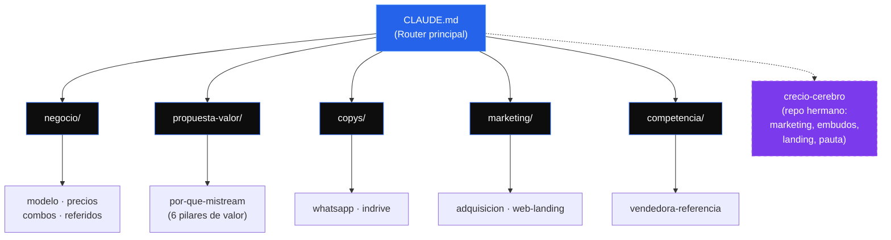

# MiStream · Cerebro del Proyecto

### _Tus pantallas de streaming, privadas y con respaldo_

**El segundo cerebro de MiStream** — modelo de negocio, precios, márgenes, copys y estrategia, todo en un solo lugar y como única fuente de verdad.

---

## Mapa del Cerebro

> `CLAUDE.md` es el **router**: léelo primero y te dirige a dónde está cada cosa.

---

## Navegación rápida

| Carpeta | Qué encuentras | Empieza por |
|:---|:---|:---|
| **raíz** | El router del proyecto | [`CLAUDE.md`](CLAUDE.md) |
| **negocio/** | Cómo se gana la plata | [`modelo`](negocio/modelo.md) · [`precios`](negocio/precios.md) · [`combos`](negocio/combos.md) · [`referidos`](negocio/referidos.md) |
| **propuesta-valor/** | Por qué comprarnos a nosotros | [`por-que-mistream`](propuesta-valor/por-que-mistream.md) |
| **copys/** | Qué decir para vender | [`whatsapp`](copys/whatsapp.md) · [`indrive`](copys/indrive.md) |
| **marketing/** | Cómo conseguir clientes | [`adquisicion`](marketing/adquisicion.md) · [`web-landing`](marketing/web-landing.md) |
| **competencia/** | Contra quién competimos | [`vendedora-referencia`](competencia/vendedora-referencia.md) |

---

## Qué es MiStream (en 1 párrafo)

Reventa de **perfiles privados de streaming** (Netflix, Disney, Max, Spotify, YouTube, etc.) por **arbitraje**: se compra barato al proveedor y se revende con margen sano. El proveedor da el soporte técnico; MiStream atiende, vende y cobra. Opera: Juan Manuel + parceros. Canal estrella hoy: **inDrive** (ofrecer a pasajeros tras la carrera) + WhatsApp.

---

## La estrategia en 3 ideas

> 1. **Competir por VALOR, no por precio.** Igualamos el mercado en streaming y ganamos en confianza, reposición y trato humano. Donde otros abusan (Spotify/YouTube), ahí sí ganamos en precio.
> 2. **Margen primero, nunca volumen sin ganancia.** Piso: precio ≥ 2× costo. Margen objetivo: $6.000+ por pantalla, $8.000+ en combos.
> 3. **Crecer con referidos.** Cada cliente trae clientes; nadie regala margen sin contraparte.

---

## El gancho de valor

| Servicio | Competencia | MiStream | Tú ahorras |
|----------|------------:|---------:|-----------:|
| Spotify Premium | $22.000 | **$14.000** | $8.000 |
| YouTube Premium | $24.000 | **$14.000** | $10.000 |

> Mismo servicio, precio justo. Es nuestro mejor argumento en cada conversación.

---

## Estado y pendientes

**Fase:** Validación / MVP — adquisición orgánica activa vía inDrive.

- [ ] Primera venta consolidada (validar MVP)
- [ ] Crear y calentar cuentas TikTok + IG
- [ ] Estructurar canal de Telegram
- [ ] Plan de contenido (3 videos/semana)
- [ ] Confirmar costos de: Universal+, Flujo TV, Apple TV, DirectTV GO, Viki, Telelatino
- [ ] Landing web (cuando el flujo por WhatsApp esté validado)

---

## Conexión con Creció

Para **marketing, embudos, ofertas, copywriting avanzado, Meta Ads y landing pages**, este repo NO reinventa nada: consulta el repo hermano **`crecio-cerebro`**. El `CLAUDE.md` tiene el índice de qué buscar y dónde.

---

**Documento vivo** · Proyecto **MiStream** · Operado por **Juan Manuel + parceros**

*Última actualización: 26 junio 2026*

📋 [Ver historial de cambios →](changelog.md)

